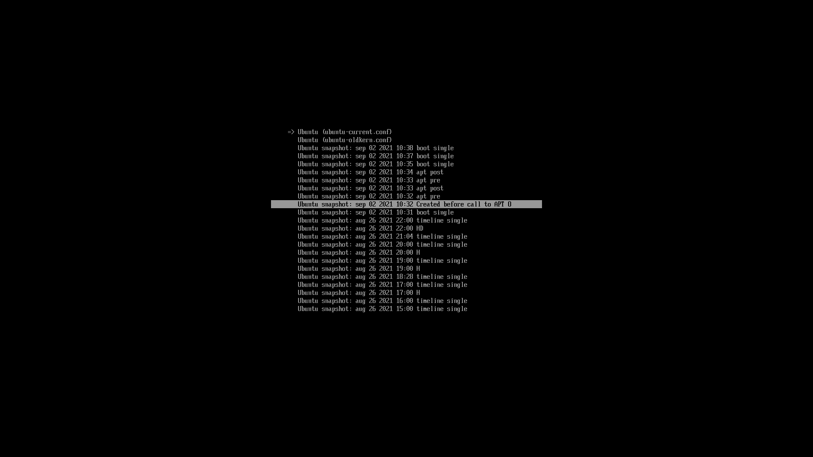
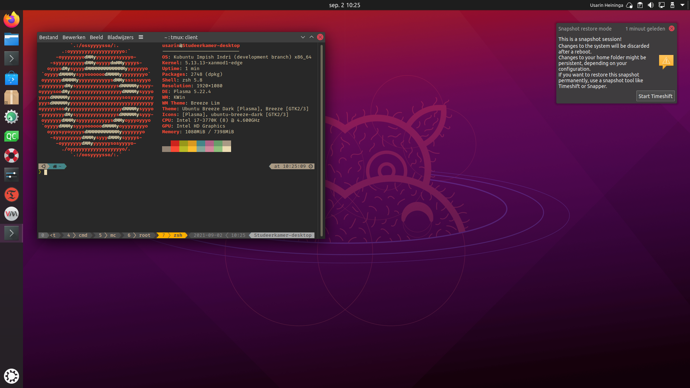

### systemd-boot-snapshots

### Description:

Systemd-boot-snapshot improves systemd-boot by adding btrfs snapshots to the boot menu.

You can boot your system into a snapshot from the boot menu.
It has support for all btrfs snapshots,
including "Timeshift" and "Snapper".
Read-only snapshots are supported as well.
Supported initrd systems are "initramfs-tools" and "dracut", but only on Ubuntu like systems for now.

By default a root overlay is setup when booting into a snapshot.
This prevents changes to a snapshot and makes it possible to boot a read-only snapshot.

With systemd-boot there is a big chance the booted kernel is not supported by
the snapshot, since the kernel is installed on the UEFI partition and is not part of the snapshot.
When this is the case, systemd-boot-snapshots will mount the /lib/modules/{KERNEL_VERSION} directory
from the master snapshot onto the modules directory from the snapshot.

A notification message will be shown at the desktop to notify the user of being booted into a snapshot.

## Screenshots:

Boot menu:


Desktop with "booted into a snapshot" notification:


### Requirements:
systemd, libglib2.0-bin and overlayroot when using initramfs-tools.

### Install:
```
sudo make install
sudo update-initramfs -ckall
```

After this you should run the tool you use to copy the kernel image to the UEFI partition (kernelstub for example).

Ubuntu packages are available at my private repository at ppa:usarinheininga/ubuntu-plasma.
To add this repository and install systemd-boot-snapshots, run:
```
sudo add-apt-repository ppa:usarinheininga/ubuntu-plasma
sudo apt-get update
sudo apt install systemd-boot-snapshots
```

### Usage:
Systemd-boot-snapshots will monitor the system for new snapshots or changes to the boot loader config entries
and update when needed.

To manually populate the boot menu with the available snapshots, run:
```
sudo update-systemd-boot-snapshots
```

At boot press space to enter the boot menu.
Now you can select a snapshot entry to boot into.
